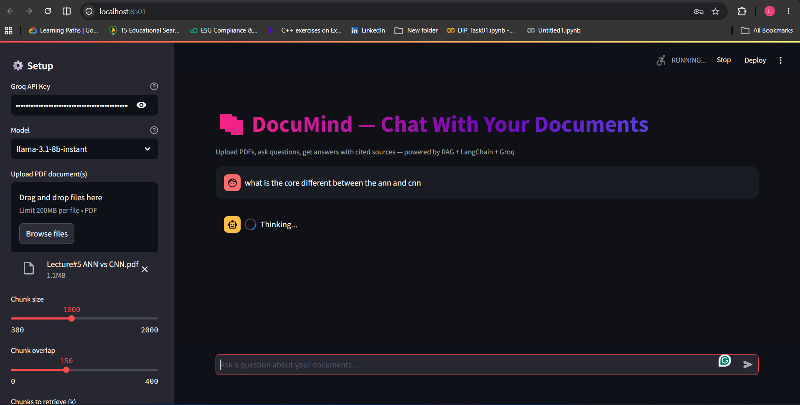

#  DocuMind — AI-Powered Document Q&A (RAG)

DocuMind is a Retrieval-Augmented Generation (RAG) application that lets you
upload PDF documents and ask natural-language questions about their content.
It retrieves the most relevant passages from your document and uses a large
language model to generate accurate, **source-cited** answers — so you can
always trace an answer back to the exact page it came from.

Built with **LangChain**, **FAISS**, **HuggingFace sentence embeddings**, and
**Groq** for ultra-fast LLM inference. Fully free to run and deploy.

---

##  Features

-  Upload one or more PDF documents
-  Chat-style interface to ask questions about the content
-  Retrieval-based answers grounded in your actual document (reduces hallucination)
-  Expandable "View sources" panel showing the exact page and text chunk used for each answer
-  Adjustable chunk size, overlap, and number of retrieved chunks (tunable in the sidebar)
-  Fast responses via Groq's free-tier LLM API (Llama 3.1 / 3.3, GPT-OSS)
-  Runs entirely on free tools — local embeddings (no API cost), in-memory FAISS vector store

---

##  How It Works

```
PDF Upload → Text Extraction (PyPDF) → Chunking (LangChain) 
   → Embeddings (sentence-transformers, local) → FAISS Vector Store
   → User Question → Similarity Search → Top-k Chunks
   → Prompt + Context → Groq LLM → Answer + Cited Sources
```

1. **Ingestion**: PDFs are parsed page-by-page and split into overlapping text chunks.
2. **Embedding**: Each chunk is converted into a vector using the free, local `all-MiniLM-L6-v2` model.
3. **Indexing**: Vectors are stored in FAISS for fast similarity search.
4. **Retrieval**: When you ask a question, it's embedded and matched against the indexed chunks to find the most relevant ones.
5. **Generation**: The retrieved chunks + your question are sent to a Groq-hosted LLM, which generates an answer grounded in that context.
6. **Citation**: The exact source chunks (with page numbers and filenames) are displayed alongside the answer.

---

##  Demo

**Example**: Uploading a lecture PDF on neural networks and asking a comparison question.




> **Question:** *"What is the core difference between ANN and CNN?"*
>
> **Answer:** The assistant returns a structured comparison covering
> architecture, data type handling, feature extraction approach, and
> computational efficiency — each point backed by the retrieved lecture
> content.
>
> **Sources shown:** `Lecture#5 ANN vs CNN.pdf` — pages 0, 1, and 2, with the
> exact text snippets used to generate the answer.

*(Add your own screenshots here — e.g. `screenshots/demo.png` — by placing
image files in a `screenshots/` folder and referencing them like:*
`` *)*

---

## 🛠️ Tech Stack

| Layer         | Tool                                     | Cost      |
|---------------|-------------------------------------------|-----------|
| UI            | Streamlit                                  | Free      |
| Orchestration | LangChain                                  | Free      |
| Embeddings    | HuggingFace `all-MiniLM-L6-v2` (local)     | Free      |
| Vector store  | FAISS (in-memory)                          | Free      |
| LLM           | Groq (Llama 3.1 / 3.3, GPT-OSS)            | Free tier |
| Hosting       | Streamlit Community Cloud                  | Free      |

---

##  Getting Started

### Prerequisites

- Python 3.10–3.12
- A free [Groq API key](https://console.groq.com/keys)

### Installation

```bash
git clone https://github.com/<your-username>/<your-repo>.git
cd <your-repo>

python -m venv venv
source venv/bin/activate      # on Windows: venv\Scripts\activate

pip install -r requirements.txt
```

### Run locally

```bash
streamlit run app.py
```

Open `http://localhost:8501`, paste your Groq API key in the sidebar, upload
a PDF, click **Process Documents**, and start asking questions.

---

